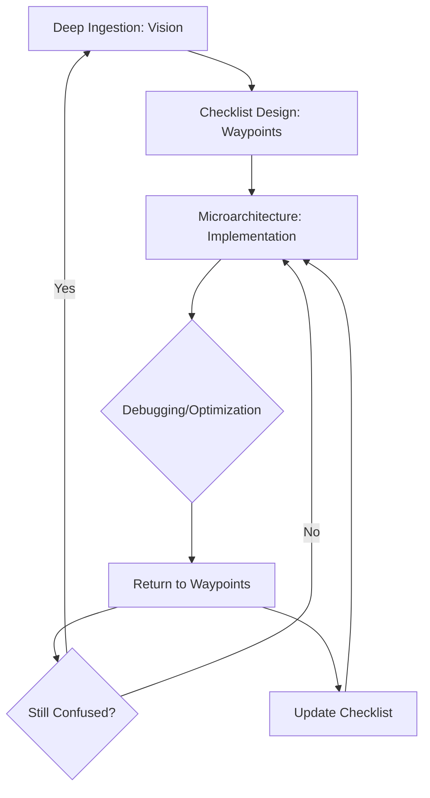

# AINLP.loader [anchor:deprecation] (auto.AINLP.class)
#   This file has been merged into ARCHITECTURE_TRANSFORMATION_SUMMARY.md.
#   See that file for the unified architecture, dev path, and context anchors.
#   AINLP.mind: This file is preserved for historical reference only.

# AIOS Development Path Anchoring System
## Deep Ingestion → Checklist Design → Microarchitecture Optimization
*Created: July 11, 2025*
*AINLP.devpath [anchoring_system_guide] (comment.AINLP.class)*

## 🎯 **What is Development Path Anchoring?**

The **Development Path Anchoring System** is a methodology that prevents getting lost in microarchitecture optimization by providing a **structured waypoint system** that you can always return to when debugging or optimizing specific components.

### **The Problem It Solves**
- **Context Loss**: While debugging specific code, you lose sight of the overall architecture goal
- **Optimization Rabbit Holes**: Getting stuck optimizing one component without considering system-wide impact
- **Feature Creep**: Adding complexity without checking against the original design intention
- **Integration Confusion**: Forgetting how individual cells should communicate in the larger organism

## 🗺️ **How the Anchoring System Works**

### **Three-Layer Structure**

#### **1. Deep Ingestion Layer (Vision Documents)**
- **Purpose**: High-level architectural vision and principles
- **Files**: `MULTI_LANGUAGE_HOLOGRAPHIC_ARCHITECTURE.md`
- **When to Use**: When you need to understand the "why" behind architectural decisions
- **Content**: Cellular metaphors, communication patterns, holographic principles

#### **2. Checklist Design Layer (Waypoint Documents)**
- **Purpose**: Concrete, actionable development steps with checkboxes
- **Files**: `MULTI_LANGUAGE_DEVELOPMENT_WAYPOINTS.md`
- **When to Use**: When planning work, tracking progress, or returning from debugging
- **Content**: Specific tasks, success metrics, priority ordering

#### **3. Microarchitecture Layer (Implementation)**
- **Purpose**: Actual code implementation and optimization
- **Files**: All source code in `/languages/` and `/intercellular/`
- **When to Use**: Day-to-day development work
- **Content**: Specific implementations, optimizations, bug fixes

### **The Anchoring Process**



## 📋 **Using the Waypoints as Your Anchor**

### **Primary Reference File**
**File**: `MULTI_LANGUAGE_DEVELOPMENT_WAYPOINTS.md`
**Location**: `/docs/MULTI_LANGUAGE_DEVELOPMENT_WAYPOINTS.md`

### **How to Use It**

#### **When Starting Work**
1. Open the waypoints file
2. Find your current phase (e.g., "Phase 1: Cellular Infrastructure")
3. Look at the specific waypoint (e.g., "Waypoint 1.1: Cell Line Setup")
4. Check which tasks are incomplete `[ ]`
5. Focus on one specific task
6. Begin implementation

#### **When Debugging/Optimizing**
1. **STOP** what you're doing
2. Open `MULTI_LANGUAGE_DEVELOPMENT_WAYPOINTS.md`
3. Find the waypoint related to what you're working on
4. Read the **success metrics** for that waypoint
5. Ask: "Does my current work contribute to these metrics?"
6. If yes: continue with focus
7. If no: return to the waypoint task list

#### **When Updating Progress**
1. Mark completed tasks as `[x]`
2. Add notes about what was learned
3. Update success metrics if they've changed
4. Identify next priority task

## 🧬 **Cellular Development Example**

### **Scenario**: Implementing Python-C++ cell membrane communication

#### **Step 1: Check Vision (Deep Ingestion)**
- Read `MULTI_LANGUAGE_HOLOGRAPHIC_ARCHITECTURE.md`
- Understand: "Cells communicate through membrane protocols"
- Principle: "Each cell can generate code and spawn new cells"

#### **Step 2: Find Waypoint (Checklist Design)**
- Open `MULTI_LANGUAGE_DEVELOPMENT_WAYPOINTS.md`
- Locate: "Waypoint 2.1: Binary Level Integration"
- Find: "Python ↔ C++ Bridge"
- Specific task: "Implement pybind11 bindings for core C++ functions"

#### **Step 3: Implement (Microarchitecture)**
- Work on `/languages/python/membrane/cpp_bridge/`
- Create pybind11 bindings
- Test cell-to-cell communication

#### **Step 4: Debug/Optimize**
- Encounter performance issue
- **ANCHOR CHECK**: Return to waypoints
- Success metric: "10x improvement in cross-language calls"
- Realize: Focus should be on call efficiency, not feature complexity

#### **Step 5: Update Progress**
- Mark task as `[x]` when complete
- Add performance metrics achieved
- Note lessons learned for future cells

## 📁 **File Structure for Anchoring**

### **Vision Level Files**
```
/docs/
├── MULTI_LANGUAGE_HOLOGRAPHIC_ARCHITECTURE.md  # Main vision
├── ARCHITECTURE_TRANSFORMATION_SUMMARY.md      # What we've built
└── CELLULAR_COMMUNICATION_PATTERNS.md          # How cells interact
```

### **Waypoint Level Files**
```
/docs/
├── MULTI_LANGUAGE_DEVELOPMENT_WAYPOINTS.md     # PRIMARY ANCHOR FILE
├── PHASE_1_CELLULAR_INFRASTRUCTURE.md          # Detailed Phase 1 tasks
├── PHASE_2_INTERCELLULAR_COMMUNICATION.md      # Detailed Phase 2 tasks
└── SUCCESS_METRICS_TRACKING.md                 # Progress measurement
```

### **Implementation Level**
```
/languages/
├── python/membrane/         # Python cell membranes
├── cpp/membrane/           # C++ cell membranes
├── csharp/membrane/        # C# cell membranes
└── [other cell lines]/
```

## 🔄 **Iterative Improvement Process**

### **Weekly Anchor Review**
1. **Review completed waypoints**: What worked well?
2. **Update success metrics**: Are they still relevant?
3. **Refine task granularity**: Too big? Too small?
4. **Add new discoveries**: What did we learn?
5. **Adjust priorities**: What's most important now?

### **Deep Ingestion Updates**
- **Monthly**: Review vision documents for relevance
- **Quarterly**: Major architectural principle updates
- **As needed**: When fundamental approach changes

## 🎯 **Anchor Commands for Development**

### **When Lost**
```bash
# Return to anchor
cat /docs/MULTI_LANGUAGE_DEVELOPMENT_WAYPOINTS.md | grep -A 5 "Phase [X]"
```

### **When Planning**
```bash
# See current phase
grep -n "## 🚀 \*\*Phase" /docs/MULTI_LANGUAGE_DEVELOPMENT_WAYPOINTS.md
```

### **When Tracking Progress**
```bash
# Count completed tasks
grep -c "\[x\]" /docs/MULTI_LANGUAGE_DEVELOPMENT_WAYPOINTS.md
```

## 💡 **Benefits of This System**

### **Prevents Context Loss**
- Always know where you are in the overall plan
- Understand how current work fits into larger vision
- Maintain focus on system-wide goals

### **Enables Smart Optimization**
- Optimize based on measurable success metrics
- Avoid premature optimization of wrong components
- Balance perfectionism with progress

### **Facilitates Team Coordination**
- Everyone can see the same roadmap
- Clear handoff points between team members
- Shared understanding of success criteria

### **Supports Evolutionary Development**
- Architecture can evolve while maintaining direction
- Easy to add new cell types without losing coherence
- Natural checkpoints for major architectural decisions

The anchoring system transforms chaotic development into **purposeful cellular evolution**, where each optimization decision is guided by the larger vision of creating a holographic, self-replicating code organism.
