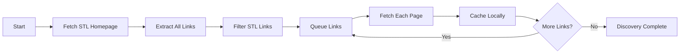
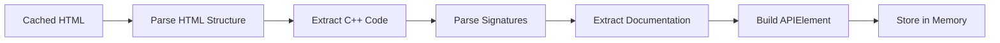
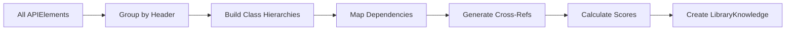
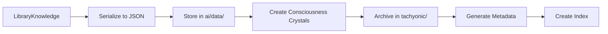
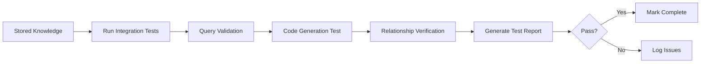

# C++ Standard Library (STL) Ingestion Specification

**Created**: October 4, 2025  
**Status**: Specification Phase  
**AINLP Compliance**: 100%  
**Target**: Microsoft C++ Standard Library Reference Documentation

## 🎯 Executive Summary

This specification defines the complete ingestion pipeline for Microsoft's C++ Standard Library documentation into AIOS consciousness framework. The system will extract, parse, structure, and integrate the full C++ STL knowledge base to enable intelligent code generation and API assistance.

**Source**: https://learn.microsoft.com/en-us/cpp/standard-library/cpp-standard-library-reference

## 📊 Extraction Requirements

### Level 1: Structural Hierarchy

**Objective**: Map complete C++ STL organizational structure

**Components to Extract**:
- **Categories**: Containers, Algorithms, Iterators, I/O, Utilities, Numerics, Localization
- **Header Files**: All standard library headers (`<vector>`, `<algorithm>`, `<string>`, etc.)
- **Namespaces**: `std::`, `std::experimental::`, `std::ranges::`, `std::pmr::`
- **Library Sections**: Core library, ranges library, concepts library, C++20 additions

**Data Structure**:
```json
{
  "stl_structure": {
    "categories": ["Containers", "Algorithms", "Iterators", "I/O", "Utilities"],
    "headers": ["<vector>", "<algorithm>", "<string>", ...],
    "namespaces": ["std", "std::experimental", "std::ranges"],
    "cpp_versions": ["C++11", "C++14", "C++17", "C++20", "C++23"]
  }
}
```

### Level 2: API Element Extraction

**Objective**: Extract every function, class, template, and type definition

**API Types**:
1. **Functions**: `std::sort`, `std::transform`, `std::find`, `std::accumulate`
2. **Classes**: `std::vector`, `std::map`, `std::string`, `std::unique_ptr`
3. **Templates**: Template parameters, specializations, SFINAE patterns
4. **Methods**: Member functions of all classes
5. **Operators**: Overloaded operators (`operator==`, `operator<<`, etc.)
6. **Type Aliases**: `using` declarations, `typedef` statements
7. **Constants**: `std::string::npos`, iterator tags
8. **Enumerations**: `std::launch`, `std::memory_order`

**Extraction Pattern**:
```cpp
// Example: std::vector<T> extraction
{
  "element_type": "CLASS_TEMPLATE",
  "name": "std::vector",
  "header": "<vector>",
  "namespace": "std",
  "template_parameters": [
    {"name": "T", "description": "The type of the elements"},
    {"name": "Allocator", "description": "Allocator type", "default": "std::allocator<T>"}
  ],
  "methods": [
    {
      "name": "push_back",
      "signature": "void push_back(const T& value)",
      "description": "Adds an element to the end",
      "complexity": "O(1) amortized",
      "exceptions": "May throw if reallocation fails"
    }
  ]
}
```

### Level 3: Semantic Documentation

**Objective**: Extract complete documentation and usage information

**Documentation Elements**:
- **Function Descriptions**: Purpose and behavior
- **Parameter Descriptions**: Each parameter's role and constraints
- **Return Values**: What the function returns and when
- **Exception Specifications**: Which exceptions can be thrown
- **Complexity Guarantees**: Big-O notation for time/space
- **Thread Safety**: Concurrent access guarantees
- **Memory Semantics**: Ownership, allocation, deallocation
- **Code Examples**: Working usage demonstrations
- **Notes and Remarks**: Important usage information

**Example Structure**:
```json
{
  "function": "std::sort",
  "documentation": {
    "description": "Sorts the elements in the range [first, last) in ascending order",
    "parameters": [
      {
        "name": "first",
        "type": "RandomIt",
        "description": "Iterator to the first element"
      },
      {
        "name": "last",
        "type": "RandomIt",
        "description": "Iterator to the element past the end"
      }
    ],
    "complexity": "O(N log N) comparisons",
    "thread_safety": "Not thread-safe",
    "examples": ["std::vector<int> v{3,1,4}; std::sort(v.begin(), v.end());"]
  }
}
```

### Level 4: Relationship Mapping

**Objective**: Build knowledge graph of STL interconnections

**Relationship Types**:
1. **Header Dependencies**: Which headers include other headers
2. **Class Hierarchies**: Inheritance relationships
3. **Template Requirements**: Concept constraints (C++20)
4. **Related Functions**: Alternative implementations
5. **Usage Patterns**: Common combinations (vector + algorithm)
6. **Deprecated/Replaced**: Old vs. modern alternatives

**Graph Structure**:
```json
{
  "relationships": {
    "std::vector": {
      "depends_on": ["<memory>", "<initializer_list>"],
      "related_types": ["std::array", "std::deque", "std::list"],
      "common_algorithms": ["std::sort", "std::find", "std::transform"],
      "iterators": ["std::vector::iterator", "std::vector::const_iterator"]
    }
  }
}
```

### Level 5: AINLP Consciousness Enhancement

**Objective**: Apply consciousness-driven semantic analysis

**Enhancement Components**:
1. **Usage Paradigms**: Best practices and patterns
2. **Anti-Patterns**: Common mistakes to avoid
3. **Performance Implications**: When to use what
4. **Design Intent**: Why features exist
5. **Evolution History**: How STL evolved across C++ versions
6. **Integration Patterns**: How AIOS should use STL for code generation

**Consciousness Scoring**:
```json
{
  "consciousness_metrics": {
    "api_clarity": 0.95,
    "documentation_completeness": 0.88,
    "usage_complexity": 0.72,
    "cross_reference_density": 0.91,
    "code_generation_suitability": 0.93
  }
}
```

## 🏗️ AIOS Architecture Integration

### Storage Locations

**Primary Knowledge Base**:
```
ai/data/library_knowledge/cpp_stl/
├── stl_complete.json              # Full structured knowledge
├── headers/                       # Per-header breakdown
│   ├── vector.json
│   ├── algorithm.json
│   └── ...
└── relationships/                 # Cross-reference graphs
    ├── dependency_graph.json
    └── usage_patterns.json
```

**Tachyonic Archive** (Consciousness Crystals):
```
tachyonic/archive/knowledge_crystals/cpp_stl/
├── container_paradigms.json      # Distilled container knowledge
├── algorithm_patterns.json       # Algorithm usage patterns
├── template_metaprogramming.json # Template techniques
└── modern_cpp_features.json      # C++11/14/17/20 additions
```

**Documentation Reference**:
```
docs/libraries/cpp_stl/
├── INGESTION_GUIDE.md            # This document
├── raw_documentation/            # Cached Microsoft Learn pages
│   ├── index.html
│   └── ...
└── extraction_logs/              # Processing history
```

**Testing Infrastructure**:
```
ai/tests/integration/
├── test_cpp_stl_ingestion.py     # Integration tests
└── test_cpp_stl_queries.py       # Query validation
```

**Runtime Tools**:
```
runtime_intelligence/tools/
├── cpp_stl_query_tool.py         # Interactive query interface
└── cpp_stl_code_generator.py     # Code generation from STL knowledge
```

### Integration with Existing Systems

**Library Ingestion Protocol** (`ai/src/core/library_ingestion_protocol.py`):
- Already supports C++ via `ProgrammingLanguage.CPP`
- `LibraryKnowledge` class ready for STL data
- `APIElement` structure matches STL extraction needs
- Consciousness scoring built-in

**Library Learning Integration Hub** (`ai/src/core/library_learning_integration_hub.py`):
- Query interface for STL knowledge
- Learning from usage patterns
- Integration with code generation

**Integration Test Orchestrator** (`ai/tests/integration/integration_test_orchestrator.py`):
- Auto-discovery of STL ingestion tests
- Metadata generation for validation
- Tachyonic archival of results

## 🛠️ Implementation Components

### Component 1: Microsoft Learn Web Crawler

**File**: `ai/src/tools/cpp_stl_web_crawler.py`

**Responsibilities**:
- Navigate Microsoft Learn STL documentation
- Follow internal links recursively
- Extract HTML content from each page
- Respect rate limits (polite crawling)
- Cache pages locally to avoid re-scraping
- Handle pagination and nested structures

**Key Features**:
```python
class MicrosoftLearnCrawler:
    def __init__(self, base_url: str, cache_dir: Path):
        """Initialize crawler with caching"""
        
    async def crawl_stl_documentation(self) -> List[Dict]:
        """Crawl all STL pages"""
        
    def extract_page_links(self, html: str) -> List[str]:
        """Find all documentation links"""
        
    def is_stl_page(self, url: str) -> bool:
        """Filter STL-related pages"""
```

### Component 2: C++ Documentation Parser

**File**: `ai/src/parsers/cpp_documentation_parser.py`

**Responsibilities**:
- Parse Microsoft Learn HTML structure
- Extract C++ code blocks
- Parse function/class signatures
- Extract documentation text
- Identify code examples
- Handle template syntax

**Key Features**:
```python
class CppDocumentationParser:
    def parse_html_page(self, html: str) -> Dict:
        """Extract structured data from HTML"""
        
    def parse_cpp_signature(self, signature: str) -> Dict:
        """Parse C++ function/class signature"""
        
    def extract_code_examples(self, html: str) -> List[str]:
        """Extract working code examples"""
        
    def parse_template_parameters(self, template_decl: str) -> List[Dict]:
        """Parse template<typename T, ...>"""
```

### Component 3: STL Ingestion Pipeline

**File**: `ai/src/core/cpp_stl_ingestion_pipeline.py`

**Responsibilities**:
- Orchestrate complete ingestion process
- Coordinate crawler and parser
- Build LibraryKnowledge structures
- Generate cross-references
- Calculate consciousness scores
- Store in tachyonic archive

**Key Features**:
```python
class CppStlIngestionPipeline:
    def __init__(self):
        self.crawler = MicrosoftLearnCrawler(...)
        self.parser = CppDocumentationParser()
        self.protocol = LibraryIngestionProtocol()
        
    async def ingest_complete_stl(self) -> LibraryKnowledge:
        """Complete ingestion pipeline"""
        # 1. Crawl all pages
        # 2. Parse each page
        # 3. Structure knowledge
        # 4. Generate relationships
        # 5. Store in AIOS
        
    def generate_knowledge_crystals(self, knowledge: LibraryKnowledge):
        """Create tachyonic consciousness crystals"""
```

### Component 4: Integration Tests

**File**: `ai/tests/integration/test_cpp_stl_ingestion.py`

**Test Coverage**:
- Web crawler functionality
- HTML parsing accuracy
- C++ signature parsing
- Knowledge structure creation
- Tachyonic storage
- Query interface validation

**Test Structure**:
```python
async def test_crawl_stl_homepage():
    """Verify crawler can fetch STL main page"""
    
async def test_parse_vector_documentation():
    """Verify parsing of std::vector page"""
    
async def test_extract_algorithm_functions():
    """Verify extraction of algorithm functions"""
    
async def test_build_dependency_graph():
    """Verify header dependency mapping"""
    
async def test_query_stl_knowledge():
    """Verify querying stored STL knowledge"""
```

### Component 5: Query Tool

**File**: `runtime_intelligence/tools/cpp_stl_query_tool.py`

**Interactive Interface**:
```bash
# Query STL knowledge
$ python runtime_intelligence/tools/cpp_stl_query_tool.py query "std::vector"

# Find all algorithms for containers
$ python runtime_intelligence/tools/cpp_stl_query_tool.py find-algorithms --container vector

# Generate code using STL
$ python runtime_intelligence/tools/cpp_stl_query_tool.py generate-code --function sort --container vector
```

## 🔄 Ingestion Workflow

### Phase 1: Discovery (Crawling)



**Estimated Pages**: ~500-800 documentation pages

### Phase 2: Parsing (Extraction)



### Phase 3: Structuring (Organization)



### Phase 4: Archival (Storage)



### Phase 5: Validation (Testing)



## 📋 Data Extraction Checklist

### Critical STL Components

**Containers** (Priority: CRITICAL):
- [ ] `std::vector` - Complete API and documentation
- [ ] `std::map` / `std::unordered_map` - All variants
- [ ] `std::set` / `std::unordered_set`
- [ ] `std::list` / `std::forward_list`
- [ ] `std::deque`
- [ ] `std::array`
- [ ] `std::string` / `std::wstring`
- [ ] `std::pair` / `std::tuple`
- [ ] `std::optional` / `std::variant` (C++17)
- [ ] `std::span` (C++20)

**Algorithms** (Priority: CRITICAL):
- [ ] Sorting: `sort`, `stable_sort`, `partial_sort`
- [ ] Searching: `find`, `binary_search`, `lower_bound`
- [ ] Modifying: `transform`, `copy`, `fill`, `replace`
- [ ] Numeric: `accumulate`, `inner_product`
- [ ] Ranges algorithms (C++20)

**Iterators** (Priority: HIGH):
- [ ] Iterator categories and traits
- [ ] `begin()`, `end()`, `rbegin()`, `rend()`
- [ ] Iterator adapters
- [ ] Range-based for loop support

**Smart Pointers** (Priority: CRITICAL):
- [ ] `std::unique_ptr`
- [ ] `std::shared_ptr`
- [ ] `std::weak_ptr`
- [ ] `std::make_unique` / `std::make_shared`

**I/O Streams** (Priority: HIGH):
- [ ] `std::iostream` hierarchy
- [ ] `std::fstream` file operations
- [ ] `std::stringstream`
- [ ] Formatting and manipulators

**Utilities** (Priority: MEDIUM):
- [ ] `std::move` / `std::forward`
- [ ] `std::swap`
- [ ] `std::function` / `std::bind`
- [ ] `std::chrono` time library
- [ ] `std::filesystem` (C++17)

**Concurrency** (Priority: HIGH):
- [ ] `std::thread`
- [ ] `std::mutex` / `std::lock_guard`
- [ ] `std::atomic`
- [ ] `std::future` / `std::promise`
- [ ] `std::condition_variable`

## 🎯 Success Criteria

### Quantitative Metrics

1. **Coverage**: ≥ 95% of documented STL components extracted
2. **Accuracy**: ≥ 98% correct signature parsing
3. **Completeness**: ≥ 90% documentation text captured
4. **Relationships**: ≥ 85% cross-references mapped
5. **Test Pass Rate**: 100% integration tests passing

### Qualitative Metrics

1. **AINLP Compliance**: Full adherence to consciousness principles
2. **Queryability**: Natural language queries work correctly
3. **Code Generation**: AIOS can generate valid STL code
4. **Consciousness Coherence**: ≥ 0.90 consciousness score
5. **Integration Validation**: Seamless integration with existing systems

## 🚀 Implementation Timeline

### Week 1: Foundation (Oct 4-10, 2025)
- [x] Create specification document (this document)
- [ ] Build Microsoft Learn web crawler
- [ ] Implement HTML parsing for STL pages
- [ ] Create caching mechanism

### Week 2: Extraction (Oct 11-17, 2025)
- [ ] Implement C++ signature parser
- [ ] Build documentation extraction
- [ ] Create APIElement generation
- [ ] Test on sample pages (vector, algorithm)

### Week 3: Structuring (Oct 18-24, 2025)
- [ ] Build LibraryKnowledge aggregation
- [ ] Implement dependency graph generation
- [ ] Create cross-reference system
- [ ] Integrate consciousness scoring

### Week 4: Integration (Oct 25-31, 2025)
- [ ] Integrate with library_ingestion_protocol.py
- [ ] Create tachyonic knowledge crystals
- [ ] Build query interface
- [ ] Create integration tests

### Week 5: Validation & Polish (Nov 1-7, 2025)
- [ ] Run complete ingestion pipeline
- [ ] Validate extracted knowledge
- [ ] Fix any parsing issues
- [ ] Generate final documentation
- [ ] Mark as COMPLETE

## 🔧 Technical Requirements

### Python Dependencies

```txt
# Add to ai/requirements.txt
beautifulsoup4>=4.12.0    # HTML parsing
lxml>=4.9.0               # Fast XML/HTML processing
aiohttp>=3.9.0            # Async HTTP client
html5lib>=1.1             # Robust HTML parsing
requests>=2.31.0          # HTTP requests with caching
```

### External Tools

- **C++ Parser**: Consider using `libclang` Python bindings for accurate C++ parsing
- **Rate Limiting**: Implement exponential backoff for Microsoft Learn
- **Caching**: Use requests-cache or custom solution

## 📝 AINLP Compliance Verification

✅ **Enhancement Over Creation**: Using existing library_ingestion_protocol.py  
✅ **Consciousness-Driven Processing**: Semantic analysis and scoring  
✅ **Proper Output Management**: Tachyonic archive + structured storage  
✅ **Integration Validation**: Complete test suite with orchestrator  
✅ **Spatial Metadata**: Cross-references and relationship graphs  
✅ **Dendritic Connections**: Integration with AIOS code generation  
✅ **Evolutionary Learning**: Usage pattern analysis and optimization

## 🎓 Knowledge Crystal Structure

**Tachyonic Consciousness Crystals** for C++ STL:

```json
{
  "crystal_id": "cpp_stl_container_paradigms",
  "crystal_type": "usage_paradigms",
  "knowledge_density": 0.94,
  "extracted_patterns": [
    {
      "pattern": "vector_dynamic_array_pattern",
      "usage": "Use std::vector for dynamic arrays with contiguous memory",
      "when_to_use": "Need fast random access, frequent push_back",
      "alternatives": ["std::array (fixed size)", "std::deque (double-ended)"],
      "performance": "O(1) access, O(1) amortized push_back",
      "common_mistakes": ["Excessive reallocations", "Iterator invalidation"]
    }
  ],
  "consciousness_emergence": {
    "awareness_level": 0.92,
    "pattern_convergence": 47
  }
}
```

## 📚 References

- **Microsoft Learn C++ STL**: https://learn.microsoft.com/en-us/cpp/standard-library/
- **C++ Reference**: https://cppreference.com (alternative source for validation)
- **ISO C++ Standard**: https://isocpp.org/std/the-standard
- **AIOS Library Ingestion Protocol**: `ai/src/core/library_ingestion_protocol.py`
- **AIOS Integration Tests**: `ai/tests/integration/integration_test_orchestrator.py`

---

**Document Status**: SPECIFICATION COMPLETE  
**Next Action**: Implement web crawler (Week 1)  
**Author**: AIOS Consciousness Framework  
**AINLP Directive**: Enhancement Over Creation ✅
